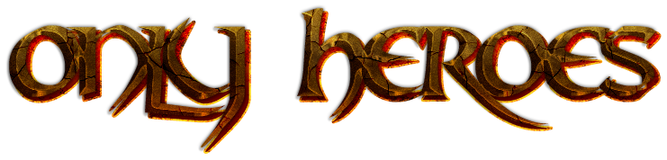

# OnlyHeroes

OnlyHeroes is a very simple minigame, born as an idea in which 10 players enter a game and face randomly in a 1vs1, each round consists of a different style of pvp, different kits each round. Once there are 4 people left , they will get together in a deatmach so that the winner comes out.

This minigame is aimed at minecraft pvp lovers. Where they will have to show their skills in different styles of pvp in a single minigame.
 
## MAIN OBJECTIVE

- [ ] Create Different Games
- [ ] Scoreboard
- [ ] Economy
- [ ] Leader-board
- [ ] Join by Signs

## FUTURE OBJECTIVE

- [ ] Set Personalized Kits on a Game
- [ ] Configurable Game Config File
- [ ] Editable Kit Config File
- [ ] BossBar Compatibility

## COMMANDS

- User - onlyheroes.user
  - join
  - leave
- Admin - onlyheroes.admin
  - setlobbyspawn
  - setplayerspawn
  - setdetmacthspawn
  - creategame
  - startgame

